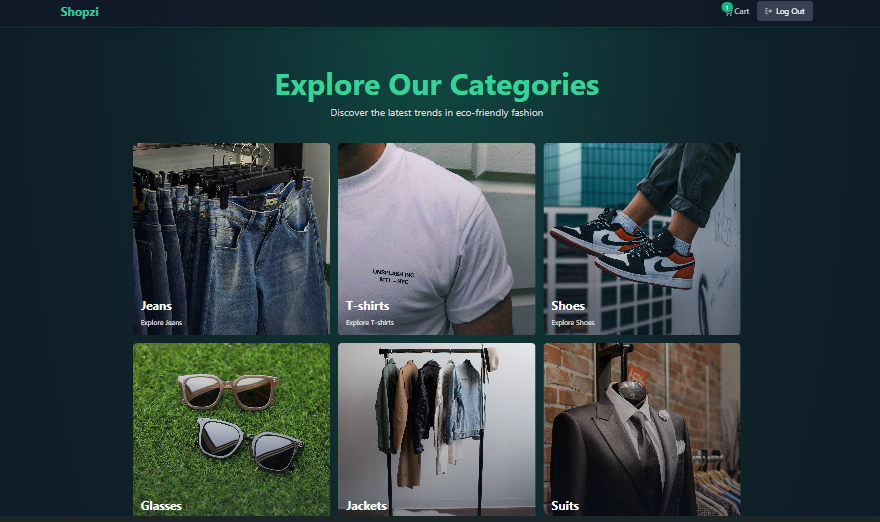

# E-commerce-store-mern

A full-featured and modern E-Commerce web application built with the MERN stack (MongoDB, Express.js, React.js, and Node.js) — featuring Redis for advanced caching and performance optimization, and Stripe for secure, production-ready payment processing. This platform offers a complete end-to-end e-commerce experience, including a customer-facing storefront, shopping cart and checkout flow, secure user authentication, and an admin dashboard for product, order, and user management. Designed with a focus on scalability, security, and performance, the application is styled with Tailwind CSS to deliver a modern, responsive UI.

---


## 🔗 Preview

 
--
🌍 Live Demo - https://shopzi.onrender.com/

---

## ✨ Features

📝 User Signup & Login <br>
🔐 Robust Authentication System  
🔑 JWT with Refresh/Access Tokens  
📦 Product & Category Management  
🛍️ Shopping Cart Functionality  
👑 Admin Dashboard  
📊 Sales Analytics   
🚀 Caching with Redis <br>
🛒 Cart & Checkout Process  
💰 Checkout with Stripe  
🏷️ Coupon Code System  
🔒 Security  
💳 Stripe Payment Setup  

---


## 🖥️ Tech Stack

### 🛠 Backend  
Built with [Node.js](https://nodejs.org/) and [Express](https://expressjs.com/), using [MongoDB](https://www.mongodb.com/) and [Redis](https://redis.io/) for data and caching. Handles secure authentication, media uploads, and payments.

- [**Express.js**](https://expressjs.com/) – Web framework for Node.js  
- [**Mongoose**](https://mongoosejs.com/) – Elegant MongoDB object modeling  
- [**ioredis**](https://github.com/luin/ioredis) – Redis client for Node.js  
- [**jsonwebtoken**](https://github.com/auth0/node-jsonwebtoken) – Secure JWT authentication  
- [**bcryptjs**](https://github.com/dcodeIO/bcrypt.js/) – Password hashing  
- [**cookie-parser**](https://github.com/expressjs/cookie-parser) – Parse Cookie header and populate `req.cookies`  
- [**dotenv**](https://github.com/motdotla/dotenv) – Loads environment variables  
- [**cloudinary**](https://cloudinary.com/documentation/node_integration) – Media management and transformation  
- [**stripe**](https://stripe.com/docs) – Payment processing API  
- [**nodemon**](https://nodemon.io/) – Auto-restarts server on file changes (dev)  
- [**concurrently**](https://github.com/open-cli-tools/concurrently) – Run multiple commands concurrently

---

### 💻 Frontend  
Built using [React.js](https://react.dev/) with [Vite](https://vitejs.dev/) for lightning-fast development, styled using [Tailwind CSS](https://tailwindcss.com/). It includes animations, charts, and Stripe checkout integration.

- [**React.js**](https://react.dev/) – UI library for building interactive interfaces  
- [**Vite**](https://vitejs.dev/) – Fast frontend build tool  
- [**React Router DOM**](https://reactrouter.com/) – Declarative routing for React  
- [**Tailwind CSS**](https://tailwindcss.com/) – Utility-first CSS framework  
- [**Framer Motion**](https://www.framer.com/motion/) – Powerful animations for React  
- [**Zustand**](https://zustand-demo.pmnd.rs/) – Lightweight global state management  
- [**Axios**](https://axios-http.com/) – Promise-based HTTP client  
- [**React Hot Toast**](https://react-hot-toast.com/) – Beautiful toast notifications  
- [**Recharts**](https://recharts.org/en-US/) – Charting library built with React  
- [**@stripe/stripe-js**](https://stripe.com/docs/stripe-js/react) – Stripe checkout integration  
- [**Lucide React**](https://lucide.dev/) – Beautiful & consistent icons  
- [**React Confetti**](https://www.npmjs.com/package/react-confetti) – Add celebratory animations

---


## <a name="getting-started">🚀 Getting Started</a>

To get started follow these steps:

#### Cloning the Repository

Using CLI

```bash
git clone https://github.com/smRid/E-commerce-store-mern.git
```

**\*\*_Ensure you have installed [Git](https://git-scm.com) on your machine._**

or using GitHub:

-   Go to the project [repository](https://github.com/smRid/E-commerce-store-mern) on my GitHub page
-   Click on the green button on the top 👆
-   Click Download ZIP


### ⚙️ Installation


## Setup .env file
```bash
PORT=5000
MONGO_URI=your_mongo_uri

UPSTASH_REDIS_URL=your_redis_url

ACCESS_TOKEN_SECRET=your_access_token_secret
REFRESH_TOKEN_SECRET=your_refresh_token_secret

CLOUDINARY_CLOUD_NAME=your_cloud_name
CLOUDINARY_API_KEY=your_api_key
CLOUDINARY_API_SECRET=your_api_secret

STRIPE_SECRET_KEY=your_stripe_secret_key
CLIENT_URL=http://localhost:5173
NODE_ENV=development
```

Install the project dependencies using npm:

### Build the app

```bash
npm run build
```

**\*\*_Ensure you have installed [NodeJS](https://nodejs.org/en) on your machine._**

### Start the app

```bash
npm run start
```

**\*\*_Navigate to http://localhost:5000 in your browser to access the local development server._**
